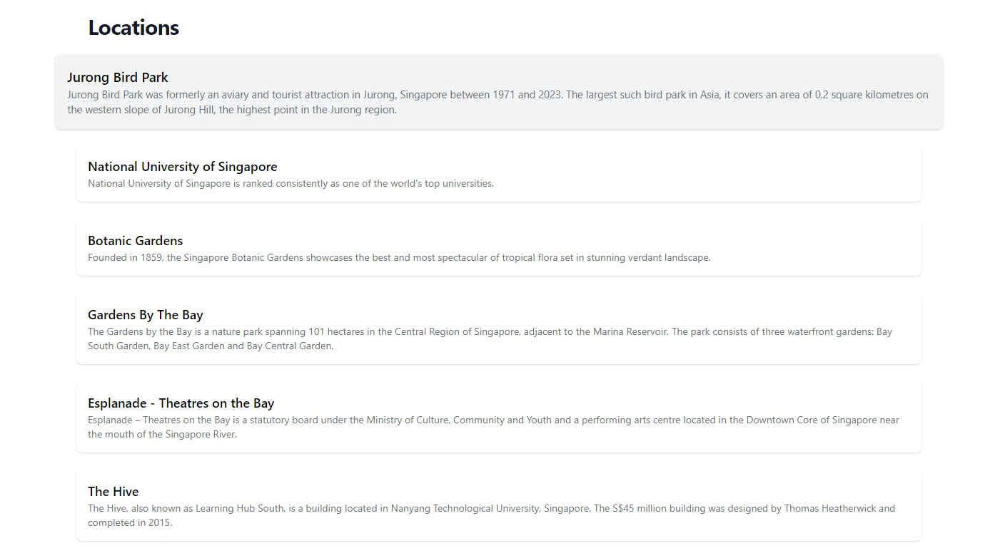
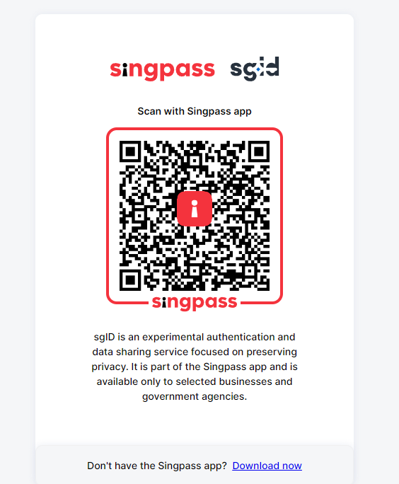

# RaceSG - The Ultimate Adventure App for Exploring Singapore


RoadSG is an exhilarating race-meets-geocaching app designed to unlock the hidden wonders of Singapore. Whether you're a local or a tourist, this app provides an extraordinary way to discover the cultural gems, breathtaking sights, and captivating stories of this vibrant city-state. Get ready to embark on an unforgettable journey and redefine how you explore Singapore.
You can read more about our [Business Proposal](Proposal.pdf) here.

## Features

### 1. Explore Captivating Locations



Browse through our user-friendly website to uncover a meticulously curated list of Singapore's most intriguing locations. Each location holds secrets waiting to be discovered. As you venture into the heart of each place, a QR code awaits, acting as a gateway to a world of exciting challenges and fascinating trivia.

### 2. Seamless Authentication with sgID

At RaceSG, we prioritize user convenience and security. That's why we have integrated with sgID, a Singapore government identity provider, to offer seamless authentication for local users. With sgID, Singapore residents can easily authenticate themselves and share government-verified data via the Singpass mobile app.


At RoadSG, we prioritize user convenience and security. That's why we have integrated with sgID, a Singapore government identity provider, to offer seamless authentication for local users. With sgID, Singapore residents can easily authenticate themselves and share government-verified data via the Singpass mobile app.

By connecting to sgID, RaceSG ensures a trusted and reliable verification process. Users can rest assured that their identities are securely verified by the Singapore government. This streamlined authentication process enhances user experience and provides a seamless onboarding journey.

Integrating with sgID allows RaceSG to access essential user information, such as full names, ensuring a personalized and tailored experience. Users can enjoy the benefits of sgID authentication without any additional costs. It's a hassle-free way to verify and authenticate local users, creating a secure and trusted environment for all RaceSG adventurers.

Experience the power of sgID integration by trying out our demo app and witness the smooth login flow for yourself. Connect with RaceSG and unlock a world of captivating adventures with the confidence of sgID authentication.

International tourists and users without Singpass may still use RaceSG by traditional email and password credentials.

### 3. Sustainable Adventures

At RaceSG, sustainability is at the core of our mission. We utilize reusable QR codes to encourage eco-friendly practices during your adventures. By scanning these codes, you'll unlock thrilling challenges that deepen your connection to the heritage and beauty of each location. Capture the perfect moment with your surroundings or test your knowledge with intriguing trivia.

### 4. Amazing Races

Local users hold the power to create their own extraordinary adventures through the Amazing Races feature. Curate and design timed events where participants must navigate a series of special stations in sequential order. Aim to emerge victorious and claim exceptional prizes. Each race is an adrenaline-fueled battle for the top spot, making RaceSG an app that brings out your competitive spirit.

### 5. Earn Rewards


As you conquer each location and complete challenges, you'll earn points that reflect your performance and dedication. These valuable points can be exchanged for exclusive rewards sponsored by the Singapore government under schemes like Rediscover Singapore. Imagine gaining free entry to renowned attractions like the Science Center or National Gallery Singapore. Your exploration of Singapore will be rewarded beyond your imagination.

## Installation

RaceSG has been deployed on [https://race-sg.vercel.app/](https://race-sg.vercel.app/) for demo purposes. If you
would like to install RaceSG, follow these steps:

1. Clone this repository to your local machine.

2. Install the required dependencies.

3. Start the app locally by running the development server:

```bash
npm run dev
# or
yarn dev
# or
pnpm dev
```

4. Access the app in your web browser at `http://localhost:3000`.

> **Note:** Please be cautious when handling the Firebase API key included in this repository. Although the API key is not a private key and is only used to identify the project with Google's servers, it's essential to exercise caution when working with any sensitive keys. It is always recommended to review the tech stack you are working with and handle any keys with care.

> **Note:** The sgID key is not provided in this case as it is meant to be kept confidential. Therefore, when testing the login with SingPass, you will encounter an error. To resolve this, you need to add in your own keys into a _.env.local_ file placed at the root directory. It should look something like this.
```
SGID_CLIENT_ID=<your client id>
SGID_CLIENT_SECRET=<your client secret>
SGID_PRIVATE_KEY=<your private key>
```
Visit [https://developer.id.gov.sg/](https://developer.id.gov.sg/) to create your own key and refer to the [documentation](https://docs.id.gov.sg/introduction/overview) for more information about sgID.

If you face any issues while dealing with the sgID authentication component of our product, please feel free to reach out to @yu_jieee on Instagram or Telegram for troubleshooting assistance.

## Coming Soon

We have exciting enhancements in the pipeline for RaceSG! Here's a sneak peek at what's coming:

- **Favoriting Locations**: Save your favorite locations within RaceSG so you can easily access them anytime. Whether it's a hidden gem or a stunning landmark, mark it as a favorite and share it with others on your favorite social media platforms.

- **Reward Marketplace**: Earn valuable points by completing challenges and conquering stations. Soon, you'll be able to exchange those points for a range of exciting rewards. Explore Singapore and reap the benefits with our curated selection of rewards, generously sponsored by the Singapore government under schemes like Rediscover Singapore.

- **Leaderboard Ranking**: Compete with other RaceSG users and see how you stack up against fellow adventurers. Our upcoming leaderboard ranking system will showcase your performance and dedication. Climb the ranks, earn bragging rights, and establish yourself as a true explorer extraordinaire.

Stay tuned for these enhancements, as we continue to evolve RaceSG to provide you with an even more immersive and rewarding experience. Adventure awaits!

## Contributing

We welcome contributions from everyone! If you have any ideas, suggestions, or bug reports, please open an issue or submit a pull request. Together, let's make RaceSG even better.

## Support

If you encounter any issues or need assistance with RaceSG, please contact our support team at support@Racesg.com. We are here to help you make the most of your adventure.

## License

This project is licensed under the [MIT License](LICENSE.md).

## Acknowledgements

We like to thank our dedicated community of adventurers who have made RaceSG an app that fosters connections and unforgettable memories.

## Stay Connected

Follow us on social media to stay updated with the latest news, challenges, and rewards:

Our Team Members:

- Justin Peng: [@justinpeng13](https://www.instagram.com/justinpeng13/)
- Yeo Yu Jie: [@yu_jieee](https://www.instagram.com/yu_jieee/)
- Xie Yiliu: [@xied09e](https://www.instagram.com/xied09e/)
- Tiang Hui Zheng: [@heyzec](https://www.instagram.com/heyzec/)

Join our vibrant community of explorers and share your RaceSG experiences using the hashtag #RaceSGAdventures.

---

This is a [Next.js](https://nextjs.org/) project bootstrapped with [`create-next-app`](https://github.com/vercel/next.js/tree/canary/packages/create-next-app).

[API routes](https://nextjs.org/docs/api-routes/introduction) can be accessed on [http://localhost:3000/api/hello](http://localhost:3000/api/hello). This endpoint can be edited in `pages/api/hello.js`.

The `pages/api` directory is mapped to `/api/*`. Files in this directory are treated as [API routes](https://nextjs.org/docs/api-routes/introduction) instead of React pages.

This project uses [`next/font`](https://nextjs.org/docs/basic-features/font-optimization) to automatically optimize and load Inter, a custom Google Font.

## Learn More

To learn more about Next.js, take a look at the following resources:

- [Next.js Documentation](https://nextjs.org/docs) - learn about Next.js features and API.
- [Learn Next.js](https://nextjs.org/learn) - an interactive Next.js tutorial.

You can check out [the Next.js GitHub repository](https://github.com/vercel/next.js/) - your feedback and contributions are welcome!

## Deploy on Vercel

The easiest way to deploy your Next.js app is to use the [Vercel Platform](https://vercel.com/new?utm_medium=default-template&filter=next.js&utm_source=create-next-app&utm_campaign=create-next-app-readme) from the creators of Next.js.

Check out our [Next.js deployment documentation](https://nextjs.org/docs/deployment) for more details.
